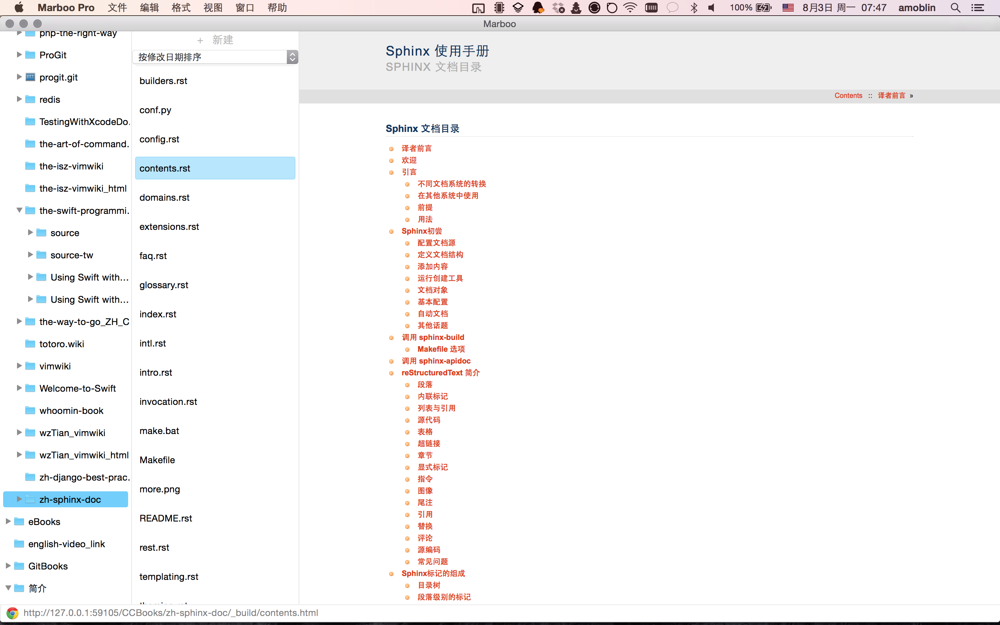

# Sphinx文档设置

<!-- create time: 2015-08-06 23:09:48  -->

<!-- This file is created by Marboo<http://marboo.io> template file $MARBOO_HOME/.media/starts/default.md
本文件由 Marboo<http://marboo.io> 模板文件 $MARBOO_HOME/.media/starts/default.md 创建 -->

一共两步，首先生成HTML文件，其次在配置文件中设置路径。

最后会有一个示例。

## 生成HTML

如果已经生成了HTML，请略过这一步。

打开终端，进入Sphinx文档所在目录，输入 `make html` 回车运行。如果没有 `sphinx-build`命令，参考文末的方法来安装sphinx。

## 配置路径

打开自定义配置文件**marboo_config.json**，找到如下内容：

```json
"comment": "For GitBook/Sphinx/VimWiki Source Files",
"url_mappings": [{
    "path":"",
    "server": ""
}],
```

添加一个url mapping，如下：

```json
{
    "path": "<Sphinx Document Source Path>",
    "server": "Sphinx"
}
```
    

如果无法显示，请显式指明html路径：

```json
{
    "path": "<Sphinx Document Source Path>",
    "replace_with": "<Sphinx Document Build HTML Path>",
    "server": "Sphinx"
}
```

其中各个key说明如下：

- *path* Sphinx源文件根目录路径，可以省掉Marboo主目录。
- *replace_with* Sphinx生成的HTML文档根目录路径，可以省掉Marboo主目录。
- *server* 文档类型，这里写 *Sphinx*


# 示例

```json
"url_mappings": [
    {
        "path": "/CC-Books/zh-sphinx-doc",
        "replace_with": "/CC-Books/zh-sphinx-doc/_build",
        "server": "Sphinx"
    }
],
```

效果如下：



---

如果没有安装Sphinx的话，参考下面。

# 安装Sphinx

Sphinx是用Python开发的，直接通过pip来安装：

```sh
pip install -U sphinx
```
