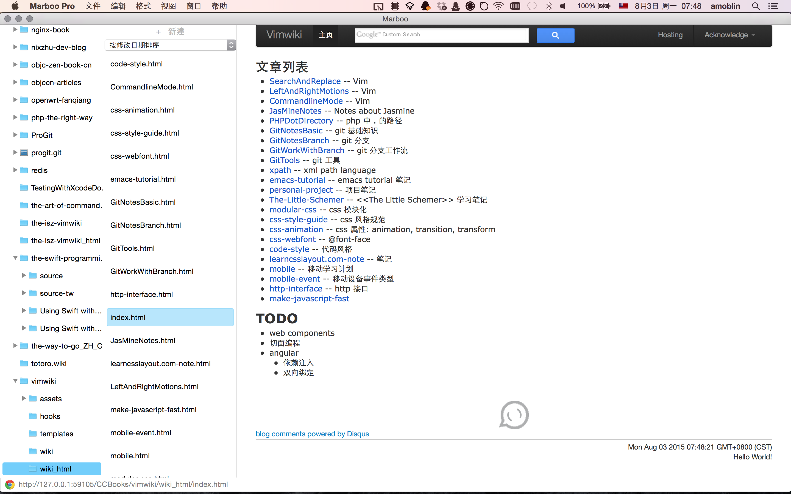

# VimWiki设置

<!-- create time: 2015-08-06 23:29:42  -->

<!-- This file is created by Marboo<http://marboo.io> template file $MARBOO_HOME/.media/starts/default.md
本文件由 Marboo<http://marboo.io> 模板文件 $MARBOO_HOME/.media/starts/default.md 创建 -->

一共两步，首先生成HTML文件，其次在配置文件中配置路径。

最后会有一个示例。

## 生成HTML

如果已经生成了HTML，请略过这一步。

打开index.wiki文件，输入 :vimwiki2allhtml 来生成HTML文件。

如果没有安装vimwik，请参考文末的方法来安装。

## 配置路径

打开自定义配置文件，找到如下内容：

```json
"comment": "For GitBook/Sphinx/VimWiki Source Files",
"url_mappings": [{
    "path":"",
    "server": ""
}],
```

添加一个url mapping，如下：

```json
{
    "path": "<VimWiki Document Source Path>",
    "server": "VimWiki"
}
```

如果无法显示，请显式指明html路径：

```json
{
    "path": "<VimWiki Document Source Path>",
    "replace_with": "<VimWiki Document Build HTML Path>",
    "server": "VimWiki"
}
```

其中各个key说明如下：

- *path* VimWiki源文件根目录路径，可以省掉Marboo主目录。
- *replace_with* VimWiki生成的HTML文档根目录路径，可以省掉Marboo主目录。
- *server* 文档类型，这里写 *VimWiki*

## Demo

```json
{
    "path": "/CCBooks/Wikis/vimwiki/wiki",
    "server": "VimWiki"
}
```

效果如下：



---

如果没有安装VimWiki的话，使用下面的方法来安装。

# 安装VimWiki

下载vba： http://code.google.com/p/vimwiki/downloads/list

使用 Vim 打开 **vimwiki.vba** ，然后执行 `:so % `

详细参考： [用 vimwiki 搭建你自己的维基世界 - 丘迟](http://wiki.ktmud.com/tips/vim/vimwiki-guide.html)

